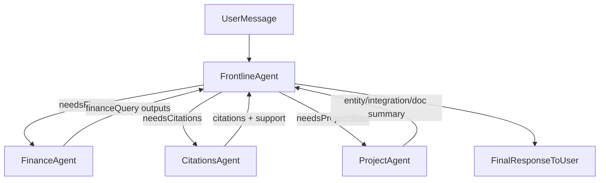

# FlowChat: AI-Assisted Development Session Export
## For Y Combinator Spring 2026 Application

This document showcases how we built FlowChat's most sophisticated feature—the Multi-Agent Orchestrator—using Cursor AI. It demonstrates planning, architecture design, implementation, and debugging workflows.

---

# Feature: Multi-Agent Chat Orchestrator

## Overview
Rebuilt the chat reasoning system around a **frontline orchestrator** that delegates to specialist agents (Finance, Citations, Project) via separate LLM calls, with structured outputs and consistent clarifying-question flows.

## The Problem We Solved
Before this feature, our chat system was monolithic—one large prompt trying to handle everything from financial queries to document citations. This led to:
- Inconsistent answers for financial questions
- No structured way to ask clarifying questions
- Difficulty maintaining policy consistency (e.g., always check bank deposits before invoices)

## Architecture Design

We designed a multi-agent system with clear separation of concerns:

### Agent Roles

**FrontlineAgent (Orchestrator)**
- Owns conversation state
- Decides which specialists to call
- Asks user clarifying questions
- Produces the final answer

**FinanceAgent (Specialist)**
- Only allowed to call `financeQuery` tool
- Interprets "income/make/brought in" as bank_statement deposits (amount_min > 0)
- Excludes transfer categories by default
- Returns clarifying questions on entity ambiguity (Personal vs Business?)

**CitationsAgent (Specialist)**
- Validates claims against retrieved sources
- Produces citation markers with quote snippets
- Flags unsupported claims

**ProjectAgent (Specialist)**
- Provides entity summary (Personal + businesses)
- Reports on integrations connected
- Runs doc coverage diagnostics

### Data Flow

## Implementation Approach

### Task Breakdown (Cursor Planning)

| ID | Task | Status | Dependencies |
|----|------|--------|--------------|
| agent-schemas | Add shared agent response schemas in lib/ai/agents/types.ts | ✅ Completed | - |
| finance-agent | Implement FinanceAgent with strict financeQuery usage, entity disambiguation | ✅ Completed | agent-schemas |
| project-agent | Implement ProjectAgent for entity summary/integration diagnostics | ✅ Completed | agent-schemas |
| citations-agent | Implement CitationsAgent for claim validation and citations | ✅ Completed | agent-schemas |
| frontline-agent | Implement FrontlineAgent orchestrator with routing and merging | ✅ Completed | agent-schemas, finance-agent, project-agent, citations-agent |
| wire-chat-route | Refactor chat route to use FrontlineAgent while preserving streaming UX | ✅ Completed | frontline-agent |

### Structured Output Contracts

We defined a shared JSON schema for specialist responses:
- `kind`: one of finance|citations|project
- `answer_draft`: string
- `questions_for_user`: string[] (when clarification needed)
- `assumptions`: string[] (what the agent assumed)
- `tool_calls`: array (records of financeQuery inputs/outputs)
- `citations`: array (source ids + optional snippets)
- `confidence`: low|medium|high

**Key Policy Decision**: If any specialist returns non-empty `questions_for_user`, the frontline agent asks those questions and does NOT finalize totals until answered.

## Key Files Created/Modified

### New Files
- `lib/ai/agents/frontline-agent.ts` - Orchestrator logic
- `lib/ai/agents/finance-agent.ts` - Finance specialist
- `lib/ai/agents/citations-agent.ts` - Citation validator
- `lib/ai/agents/project-agent.ts` - Project context provider
- `lib/ai/agents/types.ts` - Shared schemas and types

### Modified Files
- `app/(chat)/api/chat/route.ts` - Rewired to use FrontlineAgent delegation

## Acceptance Criteria

We verified the implementation with these test cases:

1. **Entity Disambiguation**
   - Ask: "How much did I make this year?" in a project with Personal + Business
   - Expected: Frontline asks "Personal or which business?" before showing totals
   - ✅ Working

2. **Business-Specific Queries**
   - Ask: "How much did Adventure Flow bring in this year?"
   - Expected: FinanceAgent uses entity_kind=business, entity_name=Adventure Flow, bank deposits first, excludes transfers
   - ✅ Working

3. **Explicit Invoice Queries**
   - Ask: "Invoice revenue this year"
   - Expected: FinanceAgent uses invoices directly (no bank fallback needed)
   - ✅ Working

---

# Other Notable Features Built with Cursor

## Slide Deck Artifact
AI generates presentation slide decks with a card-based viewer and PDF export—perfect for VC pitches.

## Finance Chart Artifacts
Interactive pie/bar charts generated from financial queries, displayed as clickable cards in chat that open in an artifact panel.

## Microsoft SharePoint Integration
Enterprise OAuth integration with MS Graph API to browse and import Teams/SharePoint files with proper PKCE flow and token encryption.

## Income Semantics + Entities (MVP)
Smart query interpretation where "how much did I make" → bank deposits only (not credit cards), with Personal vs Business entity scoping stored directly on documents (no new table needed for MVP).

---

# Development Workflow with Cursor

Our typical workflow:
1. **Planning Phase**: Describe the feature in natural language, have Cursor generate a plan with todos and dependencies
2. **Architecture**: Design the data flow with Mermaid diagrams, define contracts/types
3. **Implementation**: Work through todos in dependency order, with Cursor suggesting implementations
4. **Testing**: Define acceptance criteria upfront, verify each case
5. **Iteration**: Refactor based on actual usage patterns (see: Agent Architecture Simplification)

---

*Exported from Cursor AI session for FlowChat project*
*February 2026*
